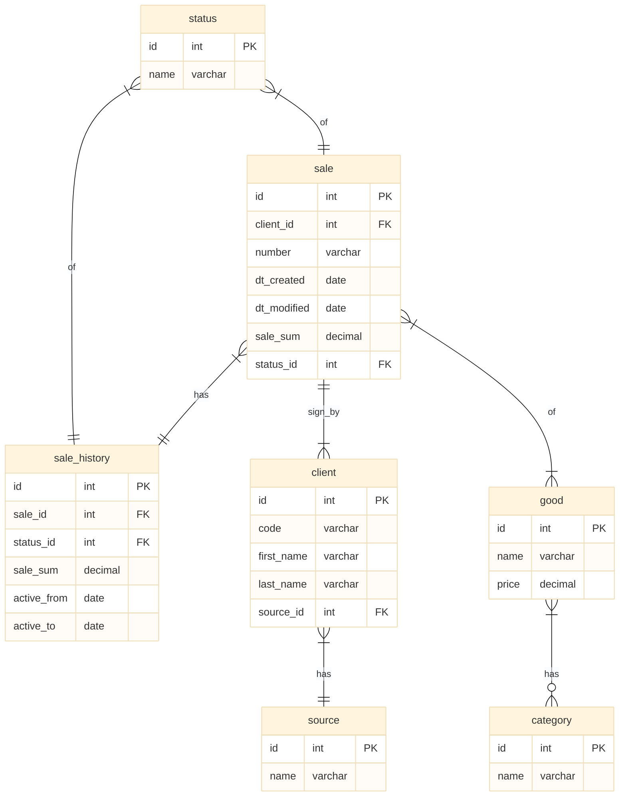

## Задание 3

### Тема: "Основы реляционных баз данных".

Дана база данных магазина `store` следующей структуры:



1. Создайте заданную базу данных

2. Выведите все позиций списка товаров принадлежащие какой-либо категории с названиями товаров и названиями категорий. Список должен быть отсортирован по названию товара, названию категории. Для соединения таблиц необходимо использовать оператор INNER JOIN. Ожидаемый формат результата:


| good_name | category_name |
| ----       | ----          |
| good 1    | category 1    |
| good 1    | category 2    |
| good 2    | category 3    |
| good 2    | category 4    |
| good 3    | category 7    |
| ... ||


*Примечание*

1. Выборки, полученные с помощью оператора `SELECT` могут быть отсортированы по нескольким атрибутам. Для этого необходимо в операторе `ORDER BY` указать набор атрибутов через запятую в необходимом порядке.

2. В запросе для соединения нескольких источников данных операцию соединения можно использовать многократно. Например, для соединения таблиц A, B и C можно использовать запрос вида:

``` SQL
SELECT * FROM A
    INNER JOIN B
        ON A.b_id = B.id
    INNER JOIN C
        ON a.c_id = C.id
```

Рекомендованные базы данных: `postgreSQL`, `mySQL`