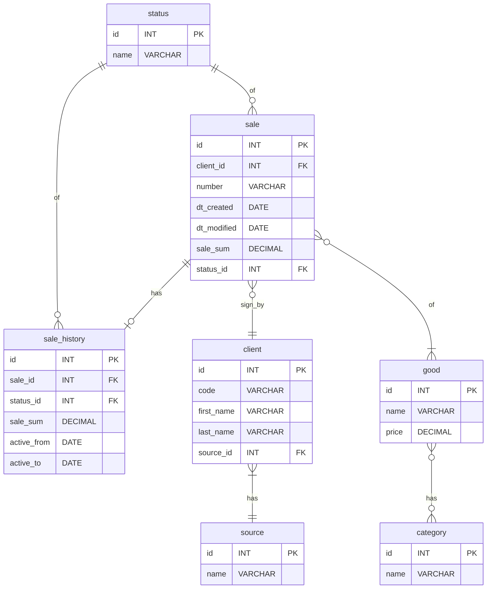
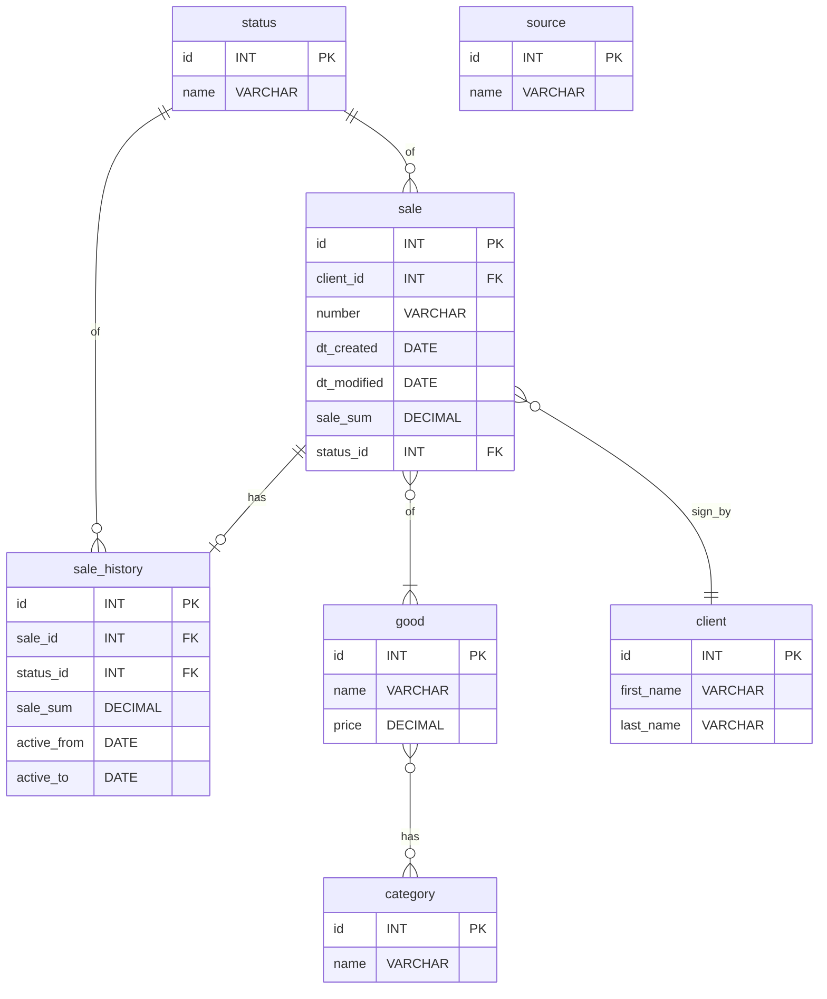

## Задание 4

[Реализация](../src/tasks/db.ipynb)

### Тема: "Основы реляционных баз данных".

Дана база данных магазина `store` следующей структуры:

В таблице `client` ограничение внешнего ключа называется
`fk_client_source1`, определенное на поле `source_id`.

1. Создайте заданную базу данных или измените уже существующую

2. Удалите из таблицы `client` поля `code` и `source_id`.

Для удаления поля, являющегося внешним ключом, необходимо
удалить ограничение внешнего ключа оператором
`DROP FOREIGN KEY `, для данного задание имя первичного ключа:
`fk_client_source1`.

Удаление ограничения внешнего ключа и поля таблицы необходимо
производить в рамках одного вызова `ALTER TABLE`

### Финальная схема базы данных `store`

> *Примечание*  
> При выполнении `ALTER TABLE` не следует указывать название схемы.  
> Рекомендованные базы данных: `postgreSQL`, `mySQL`